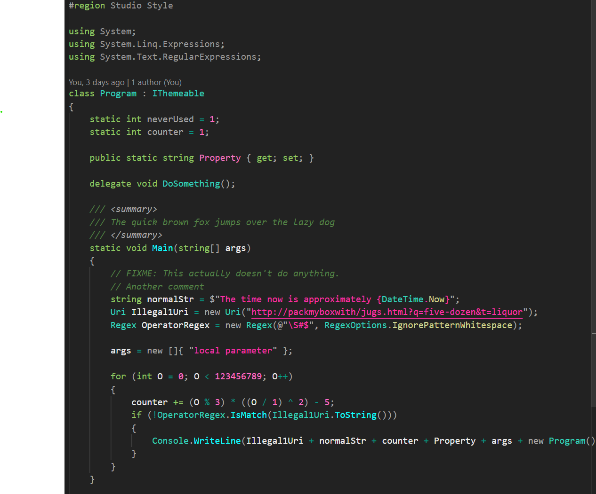

# Yoda Theme for VS Code

A dark VS Code theme that balances beauty with usability.

Carefully crafted to highlight what truly matters using vibrant, saturated colors, while gently dimming less important elements — bringing order to your code, and peace to your eyes. 

    
    

*Approved by Yoda, it is.*

## Installation

- In VSCode, go to Extensions / Search for "Yoda Theme" / Install
- Or search for "Yoda Theme" on the [VSCode Marketplace](https://marketplace.visualstudio.com/search?term=Yoda%20Theme&target=VSCode&category=Themes&sortBy=Relevance)

## Troubleshooting

- If you don't get full color syntax highlighting, make sure you have [Semantic Highlighting](vscode://settings/editor.semanticHighlighting.enabled) set to configuredByTheme, or enabled.
- [OmniSharp Semantic Highlitning](vscode://settings/csharp.semanticHighlighting.enabled) should not be needed.
- If nested braces are different colors depending on depth, you might have enabled [Bracket Pair Colorization](vscode://settings/editor.bracketPairColorization.enabled) in your settings.

## Suported Languages

Great support:

- C#
- HTML
- Razor / CSHTML

Working fine:

- C
- C++
- CSS
- Bash
- Python
- GO
- Powershell
- Perl
- Markdown
- JSON
- Javascript
- Java
- Ruby
- Rust
- SQL
- SCSS

- Check the [test-files](test-files) for other languages.